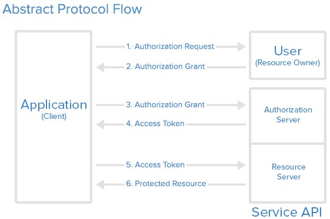

# Using OAuth 2.0 to use APIs


OAuth is an open standard for authorization used to sign into 3rd party APIs
without exposing your password.

https://oauth.net/2/

# Some common OAuth providers:

Amazon, Basecamp, Bitbucket, bitly, Box, Cloud Foundry, Dailymotion, deviantART
Discogs, Dropbox, Etsy, Evernote, Facebook, Fitbit, Flickr, Formstack, Foursquare
GitHub, Goodreads, Google, Google App Engine, Huddle, Imgur, Instagram, Intel Cloud Services
Jive Software, LinkedIn, Microsoft (Hotmail, Windows Live, Messenger, Active Directory, Xbox)
Mixi, MySpace, Netflix, Passport, PayPal, Reddit, Salesforce.com, Sina Weibo
Stack Exchange, Strava, Stripe, Tumblr, Twitch, Twitter, Ubuntu One, Viadeo
Vimeo, VK, Withings, Xero, XING, Yahoo!, Yammer, Yandex, Yelp, Zendesk,...


This is an authorization protocol, rather than an authentication protocol.
- Authentication deals with verifying your identity.
- Once authentication has been verified, authorization asks "What are you allowed
to see/what am I allowed to show you?"

# Roles

3rd party app: client
- The client is the app attempting to get access to the user’s account.  It needs to get permission from the user before it can do so.

The API: “resource server"
- This role may no apply if the request is completely client side.
- The resource server is the API server used to access the user’s info.

The User: “resource owner"
- Resource owner is the person who is giving access to some portion of their account.




- The process starts when a user requests a resource or site login from the application.
- The website sees that the user is not authenticated. It formulates a request for the identity provider, encodes it, and sends it to the user as part of a redirect URL.
- The user's browser requests the redirect URL for the identity provider, including the application's request
- If necessary, the identity provider authenticates the user (perhaps by asking them for their username and password)
- Once the identity provider is satisfied that the user is sufficiently authenticated, it processes the application's request, formulates a response, and sends that back to the user along with a redirect URL back to the application.
- The user's browser requests the redirect URL that goes back to the application, including the identity provider's response
- The application decodes the identity provider's response, and carries on accordingly.
- (OAuth only) The response includes an access token which the application can use to gain direct access to the identity provider's services on the user's behalf.

When working with an API, like Google in today's example, a developer can simply sign up via
https://console.developers.google.com/ to get access to their API libraries.

There, you first create a new project and sign up to get credentials.  The two main
credentialing values consist of:
- a client_id
- an API Key

These will be used by the REST API to authenticate you.\

```
let apiKey = 'YOUR_API_KEY';

    // Enter a client ID for a web application from the Google API Console:
    //   https://console.developers.google.com/apis/credentials?project=_
    // In your API Console project, add a JavaScript origin that corresponds
    //   to the domain where you will be running the script.

let clientId = 'YOUR_WEB_CLIENT_ID.apps.googleusercontent.com';

    // Enter one or more authorization scopes. Refer to the documentation for
    // the API or https://developers.google.com/identity/protocols/googlescopes
    // for details.

let scopes = 'profile';

let auth2; // The Sign-In object.
let authorizeButton = document.getElementById('authorize-button');
let signoutButton = document.getElementById('signout-button');

function handleClientLoad() {
  // Load the API client and auth library
  gapi.load('client:auth2', initAuth);
}
function initAuth() {
  gapi.client.setApiKey(apiKey);
  gapi.auth2.init({
      client_id: clientId,
      scope: scopes
  }).then(function () {
    auth2 = gapi.auth2.getAuthInstance();

    // Listen for sign-in state changes.
    auth2.isSignedIn.listen(updateSigninStatus);

    // Handle the initial sign-in state.
    updateSigninStatus(auth2.isSignedIn.get());
    authorizeButton.onclick = handleAuthClick;
    signoutButton.onclick = handleSignoutClick;
  });
}
function updateSigninStatus(isSignedIn) {
  if (isSignedIn) {
    authorizeButton.style.display = 'none';
    signoutButton.style.display = 'block';
    makeApiCall();
  } else {
    authorizeButton.style.display = 'block';
    signoutButton.style.display = 'none';
  }
}
function handleAuthClick(event) {
  auth2.signIn();
}
function handleSignoutClick(event) {
  auth2.signOut();
}
// Load the API and make an API call.  Display the results on the screen.
function makeApiCall() {
  gapi.client.load('people', 'v1', function() {
    let request = gapi.client.people.people.get({
      resourceName: 'people/me'
    });
    request.execute(function(resp) {
      console.log(resp);
      let p = document.createElement('p');
      let name = resp.names[0].givenName;
      let lastName = resp.names[0].familyName;
      let birthday = resp.birthdays[0].date.day +'/'+ resp.birthdays[0].date.month;
      p.appendChild(document.createTextNode('Hello, '+name+ ' ' + lastName +
      '!. Your birthday is ' + birthday));
      document.getElementById('content').appendChild(p);
    });
  });
  // Note: In this example, we use the People API to get the current
  // user's name. In a real app, you would likely get basic profile info
  // from the GoogleUser object to avoid the extra network round trip.
  console.log(auth2.currentUser.get().getBasicProfile().getGivenName());
}
```
